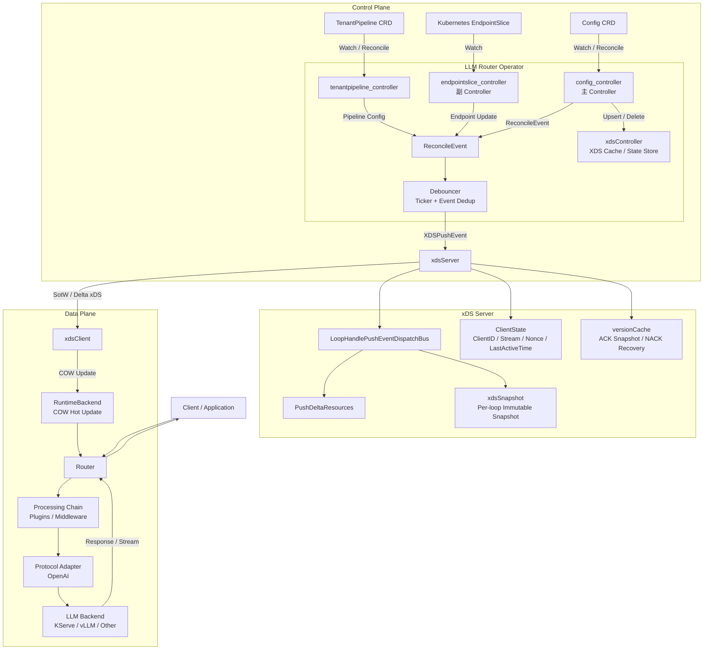
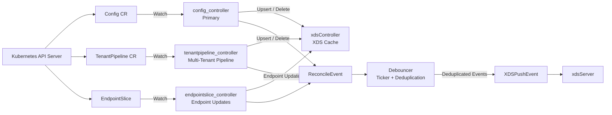
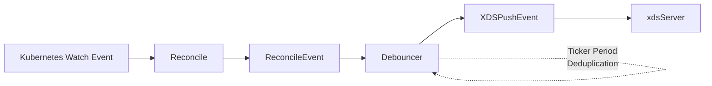
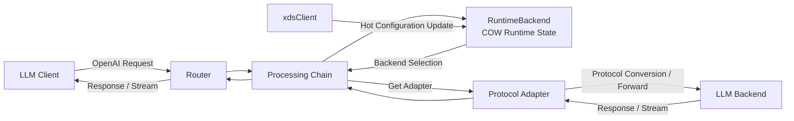
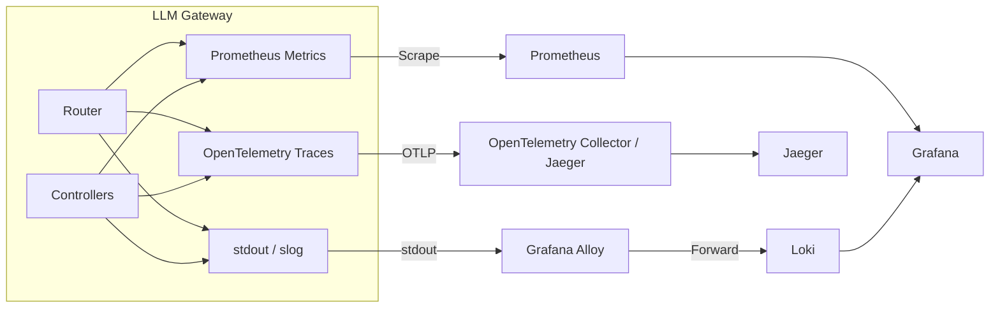

the version: 0.1.0-alpha practice-project</br>
# Introduction
A Kubernetes-native, multi-tenant LLM Gateway with a declarative control plane, xDS-based configuration distribution, pluggable processing chains, dynamic backend routing, and built-in observability.
## Quick Start
`helm install gateway -n <namespace> . -f k8s/helm/gateway-umbrella/prod-values.yaml`
## Architecture:
### 1. Overall Architecture

#### Architecture principles
Control Plane manages desired configuration and distributes runtime configuration.</br>
Data Plane handles the actual LLM traffic path.</br>
xDS decouples configuration management from request processing.</br>
Debouncer aggregates and deduplicates frequent configuration changes before pushing them to the Data Plane.</br>
Copy-on-Write RuntimeBackend enables configuration hot updates without blocking request processing.</br>
### 2. Controller Architecture: 

| Controller                  | Responsibility                                                 |
| --------------------------- | -------------------------------------------------------------- |
| `config_controller`         | Main configuration reconciliation and xDS resource lifecycle   |
| `endpointslice_controller`  | Watches EndpointSlice and updates backend endpoint information |
| `tenantpipeline_controller` | Manages tenant-specific processing-chain configuration         |

Configuration reconciliation

config_controller watches Config CR events and performs:
```text
Config CR
   │
   └── Reconcile
         │
         ├── Upsert
         │     └── DTO → xDS Resource → xdsController
         │
         └── Delete
               └── Remove namespaced resource
```

After reconciliation, the controller emits a `ReconcileEvent` instead of directly triggering an xDS push.

This decouples Kubernetes reconciliation from xDS distribution.

#### Event Stream Diagram


### 3. Data Plane
The Data Plane is responsible for processing LLM requests.

It is intentionally separated from the Kubernetes Operator and does not directly participate in Kubernetes reconciliation.

#### Request processing
```text
Client Request
      │
      ▼
    Router
      │
      ▼
Processing Chain
      │
      ├── Tenant
      ├── Routing
      ├── Plugin
      └── Policy
      │
      ▼
 RuntimeBackend
      │
      ▼
Protocol Adapter
      │
      ▼
LLM Backend
      │
      ▼
Response / Stream
```
The Data Plane supports streaming responses and dynamically selects backend services according to the latest RuntimeBackend configuration.

### 4. Configuration Propagation
Configuration propagation is based on Kubernetes reconciliation + event debouncing + xDS + Copy-on-Write runtime updates.

```mermaid
flowchart LR

    CR["Config / TenantPipeline CR"]

    Reconcile["Controller Reconcile"]

    Cache["xdsController<br/>Current State"]

    Event["ReconcileEvent"]

    Debouncer["Debouncer"]

    Push["XDSPushEvent"]

    Bus["PushEventDispatchBus"]

    Snapshot["xdsSnapshot<br/>Immutable Push Snapshot"]

    PushResources["PushDeltaResources"]

    XDS["xdsServer"]

    Client["xdsClient"]

    Runtime["RuntimeBackend<br/>COW Update"]

    CR --> Reconcile

    Reconcile -->|"Upsert / Delete"| Cache

    Reconcile --> Event

    Event --> Debouncer

    Debouncer -->|"Deduplicate within Ticker Period"| Push

    Push --> Bus

    Bus --> XDS

    XDS --> Snapshot

    Snapshot --> PushResources

    PushResources -->|"SotW / Delta"| Client

    Client -->|"Copy-on-Write"| Runtime
```

#### Why Debouncing?

Kubernetes resources can generate frequent events.

Without aggregation:
```text
CR Event
   ↓
Reconcile
   ↓
xDS Push
   ↓
CR Event
   ↓
Reconcile
   ↓
xDS Push
   ↓
...(frequency each time)
```
The `Debouncer` collects events during a configured `Ticker Period` and deduplicates them using a `map[string]struct{}` before generating `XDSPushEvent`.

#### xDS snapshot model

The xDS server separates mutable configuration state from the data used during an individual push cycle:
```text
xdsController
      │
      │ Snapshot
      ▼
 xdsSnapshot
      │
      ▼
PushDeltaResources()
      │
      ▼
SotW / Delta xDS
```
This allows each push loop to operate against a stable configuration snapshot.

#### Client state and recovery

The xDS server maintains:

```text
ClientState
├── ClientID
├── Stream
├── Nonce
└── LastActiveTime

versionCache
└── Last successfully pushed configuration
```
ClientState tracks connected Data Plane clients and assists with liveness management.

versionCache stores successfully delivered configuration snapshots and can be used for NACK recovery.
### 5. Observability

#### Metrics

The application exposes business-level and application-level metrics for Prometheus scraping.

Examples include:
```text
Request count
Request latency
Backend routing
Error rate
Streaming requests
```
#### Logging

Application logs are written to stdout using Go slog.
```text
LLM Gateway
    │
    └── stdout
          │
          ▼
      Grafana Alloy
          │
          ▼
         Loki
```
This keeps the application container-native and delegates log collection and shipping to the infrastructure layer.
#### Distributed Tracing

OpenTelemetry tracing starts at the beginning of request processing.
```text
Request
   │
   ▼
Router Span
   │
   ├── Processing Chain Span
   │
   ├── Routing Span
   │
   └── Backend Request Span
            │
            ▼
        KServe / vLLM
```
This provides end-to-end visibility into request processing and backend inference latency.