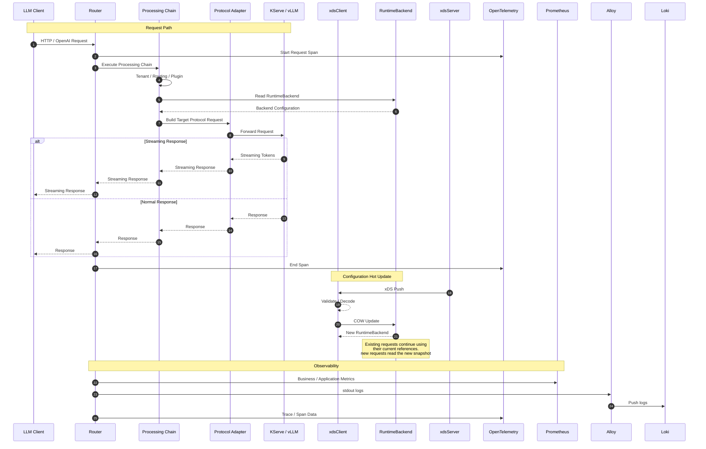

## Interaction Diagram[Details]

```mermaid
sequenceDiagram

    autonumber

    participant Client as LLM Client
    participant Router as Router
    participant Chain as Processing Chain
    participant Adapter as Protocol Adapter
    participant Backend as KServe / vLLM
    participant XDS as xdsClient
    participant Runtime as RuntimeBackend
    participant CP as xdsServer
    participant OTel as OpenTelemetry
    participant Prom as Prometheus
    participant Alloy as Alloy
    participant Loki as Loki

    Note over Client,Backend: Request Path

    Client->>Router: HTTP / OpenAI Request

    Router->>OTel: Start Request Span

    Router->>Chain: Execute Processing Chain

    Chain->>Chain:  Tenant / Routing / Plugin

    Chain->>Runtime: Read RuntimeBackend

    Runtime-->>Chain: Backend Configuration

    Chain->>Adapter: Build Target Protocol Request

    Adapter->>Backend: Forward Request

    alt Streaming Response
        Backend-->>Adapter: Streaming Tokens
        Adapter-->>Chain: Streaming Response
        Chain-->>Router: Streaming Response
        Router-->>Client: Streaming Response
    else Normal Response
        Backend-->>Adapter: Response
        Adapter-->>Chain: Response
        Chain-->>Router: Response
        Router-->>Client: Response
    end

    Router->>OTel: End Span

    Note over XDS,Runtime: Configuration Hot Update

    CP->>XDS: xDS Push
    XDS-->>XDS: Validate / Decode
    XDS->>Runtime: COW Update
    Runtime-->>XDS: New RuntimeBackend

    Note over Runtime: Existing requests continue using<br/>their current references.<br/>new requests read the new snapshot

    Note over Router,Prom: Observability

    Router->>Prom: Business / Application Metrics
    Router->>Alloy: stdout logs
    Alloy->>Loki: Push logs

    Router->>OTel: Trace / Span Data
```