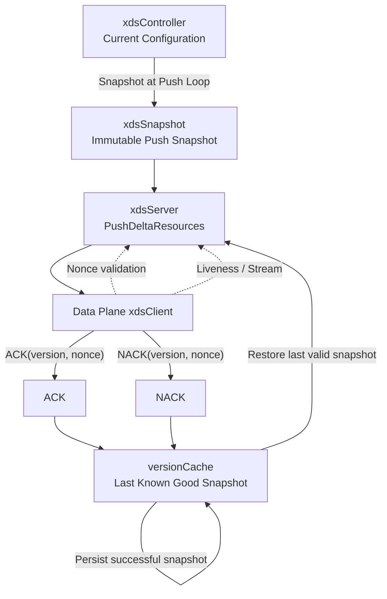

## xDS Configuration Consistency & Recovery

```mermaid
flowchart TB

    Cache["xdsController<br/>Current Configuration"]

    Snapshot["xdsSnapshot<br/>Immutable Push Snapshot"]

    Push["xdsServer<br/>PushDeltaResources"]

    Client["Data Plane xdsClient"]

    ACK["ACK"]

    NACK["NACK"]

    Version["versionCache<br/>Last Known Good Snapshot"]

    Cache -->|"Snapshot at Push Loop"| Snapshot
    Snapshot --> Push
    Push --> Client

    Client -->|"ACK(version, nonce)"| ACK
    ACK --> Version
    Version -->|"Persist successful snapshot"| Version

    Client -->|"NACK(version, nonce)"| NACK
    NACK --> Version
    Version -->|"Restore last valid snapshot"| Push

    Client -.->|"Nonce validation"| Push
    Client -.->|"Liveness / Stream"| Push
```